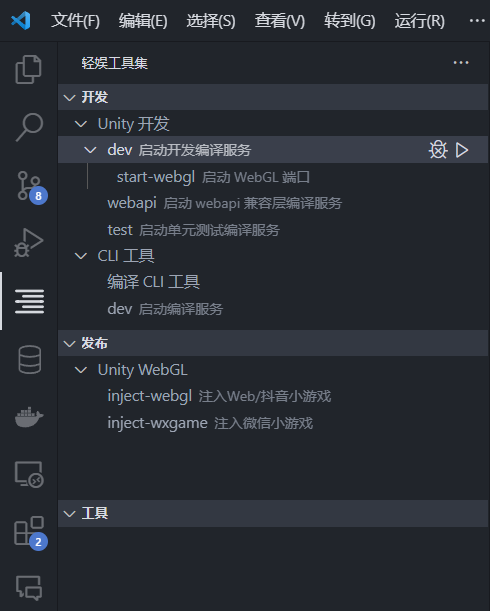
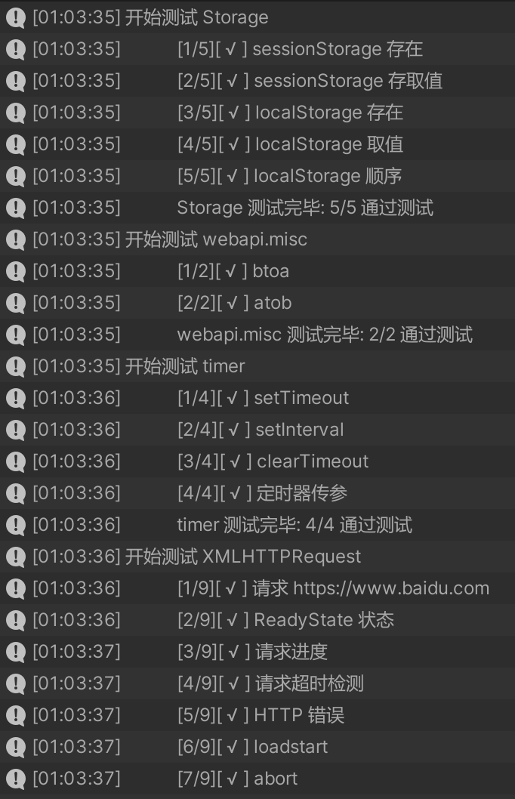

### Unity Puerts 起始项目

使用 [puerts](https://github.com/Tencent/puerts) 的 Unity 空项目，搭建好 TypeScript 编译调试工具，IDE配置等常用手脚架，不含任何游戏框架。仅提供 [webapi 兼容层](https://github.com/GodotExplorer/WebAPI)，实现部分常用的 WebAPI，并针对 Unity 优化了 Console API。

### Features
- 基础单元测试功能
- 最常用的 WebAPI 功能实现
- 使用 Webpack 构建脚本，开发模式下默认使用[ESBuild](https://github.com/evanw/esbuild)加速代码编译
- 发布代码时混淆压缩支持
- 配置好 SourceMap 和 VSCode 调试支持, 开箱即用
- 支持发布 WebGL/微信小游戏/抖音小游戏 (使用 [puerts-webgl方案](https://github.com/zombieyang/puerts_unity_webgl_demo))

### 必备知识
- Unity 基础操作
- TypeScript/JavaScript 语言
- NodeJS 和 npm/yarn

### 如何使用

0. 确保已安装如下所需的开发工具
	- NodeJS 16+
	- Visual Studio Code
		- [轻娱工具集VSCode插件](https://marketplace.visualstudio.com/items?itemName=geequlim.tiny-tool-kit) 提供一系列快捷指令
		- 
	- Unity 2019.4.8f1 及以后版本
1. 克隆该项目，通过 VSCode 和 Unity 打开
2. 使用Unity执行菜单中的`Puerts -> Generate index.d.ts` 导出 C# API
3. 在VSCode中打开`轻娱工具集`面板(插件安装完成后侧边栏会多一个图标)
	- 执行`编译 CLI 工具`命令安装依赖，并构建 CLI 工具
	- 执行`Unity 开发/dev` 命令启动TS代码持续编译服务
5. Unity中打开 `main` 场景，选中其中的 main 节点，点击属性面板中的`重置调试目录`按钮
6. 点击运行，启动游戏，如果一切顺利可以看到如下的日志，大功告成
	```log
	已启动 JavaScript 虚拟机
		at new JavaScriptApplication (src/main.ts:25:11 )
		at main (src/main.ts:10:9 )
	```

#### 主要的目录结构说明
- `src` TypeScript 脚本目录
- `tools` 开发工具命令行脚本
- `Assets/main.unity` 入口场景
- `Assets/Scripts/Resources/scripts` 编译生成的 JavaScript 脚本
- `Assets/Scripts/Editor/PuertsConfig.cs` puerts 导出配置

### 调试
- Unity 顺利启动JavaScript项目后可在 VSCode 中按 `F5` 键添加到运行中的调试器，之后便可在 TypeScript 文件中设置断点。
- 如需要调试启动相关的JavaScript代码，请在入口场景中选中`main`节点，勾选 `Wait For Debugger` 选项框。启动游戏后Unity会等待VSCode调试器连接，此时到VSCode中需要调试地方设置好断点后按`F5`连接调试器。
- 如需调试远程设备（手机真机调试），则打包前确保点击一次`main.unity -> main`节点属性面板的`重置调试目录`将脚本调试目录设置为你本地目录

### 单元测试

提供简单的单元测试，支持表达式、函数、Promise 三种测试规则，能够覆盖大多数单元测试需要。测试入口在 `src/test/GameTest.ts` 脚本中，可参考现有例子使用。

执行 test 单元测试后编译单元测试代码，Unity中运行项目可以进行单元测试
<details><summary>单元测试截图</summary>



</details>

### FAQ
- 无法下断点/日志中的堆栈总是在 bundle 文件内
	- 到 main 场景中重置调试目录
- 如何加载远程脚本，热更新脚本？
	- 实现 JavaScriptLoader 对应的接口
- 如何配置 C# 导出的接口
	- 修改 `Assets/Scripts/Editor/PuertsConfig.cs` 文件
- [puerts 的 Unity 文档](https://puerts.github.io/docs/puerts/unity/install)

#### Linux 环境使用说明
- UPM 包中没有包含 Linux 版本的动态库如无法使用，建议到[Release页面](https://github.com/Tencent/puerts/releases) 下载对应版本的V8库，并将解压到的 `libpuerts.so` 放到
`Assets/[plugins]/x86_64/libpuerts.so`
- 下载下来的动态库需要添加可执行权限
- 如果报错库中的依赖丢失，可以参考 [Tencent/puerts#941](https://github.com/Tencent/puerts/issues/941)
